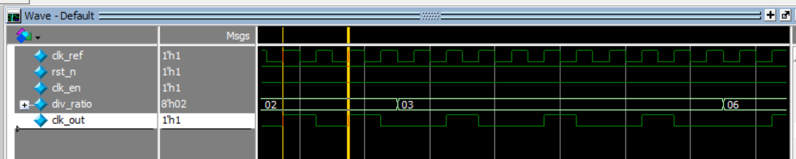
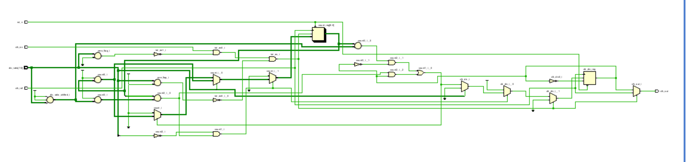
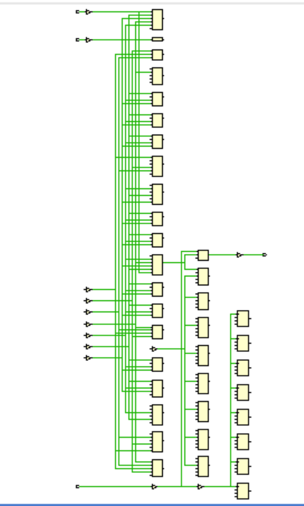
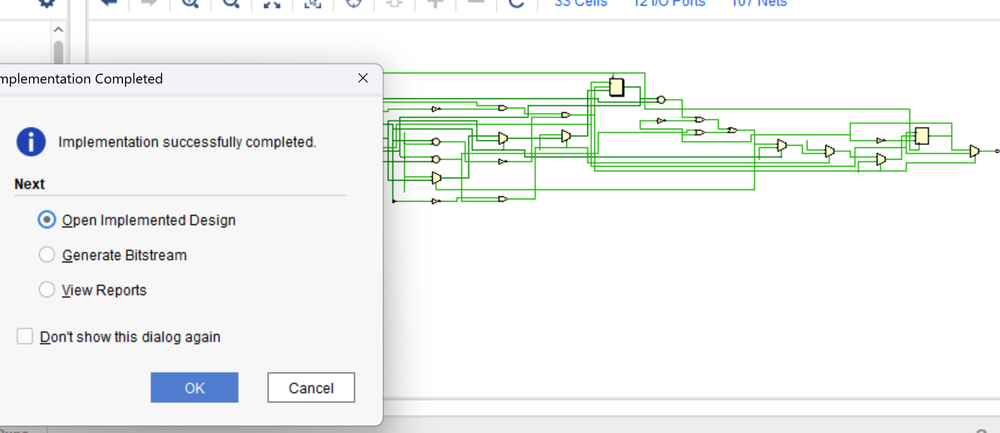
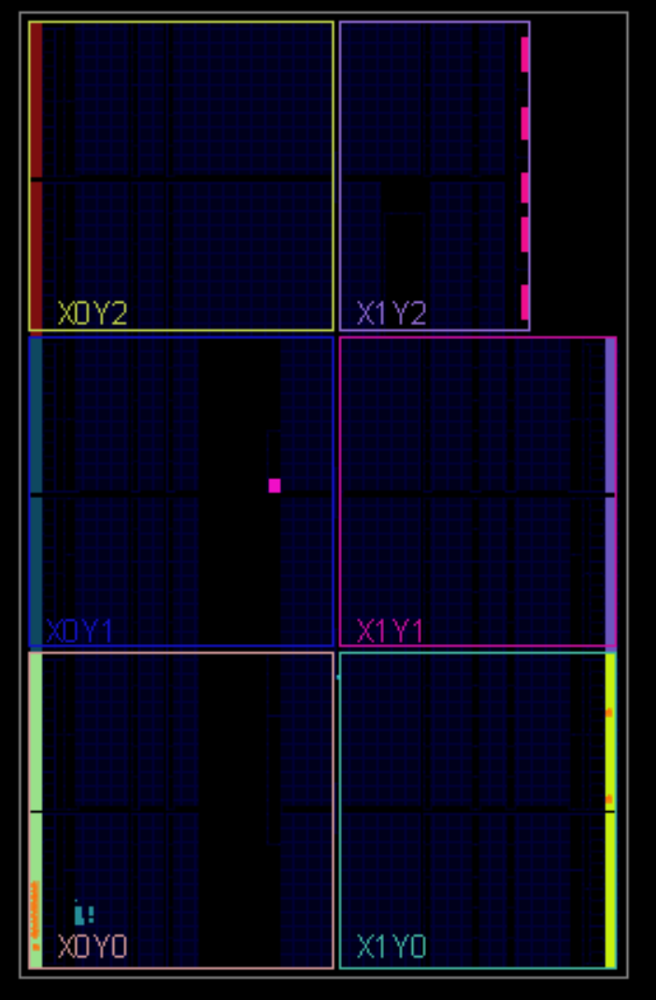

# 🧠 Integer Clock Divider  

This priject implements an *Integer_clk_division*. The design is written in **Verilog HDL**, tested with **QuestaSim**, synthesized and implemented using **Vivado**, and finally deployed to an **FPGA board**.  

---    

## 📚 Table of Contents  

- [Project Features](#-project-features)  
- [Folder Structure](#-folder-structure)
- [Testbench and Simulation](#-testbench-and-simulation)
- [Fibonacci Program Execution](#-fibonacci-program-execution)
- [FPGA Synthesis & Implementation](#-fpga-synthesis--implementation)
- [FPGA Deployment](#-fpga-deployment)
- [Tools Used](#-tools-used)
- [How to Run](#-how-to-run)
- [Author](#-author)
- [Notes](#-notes)

---   

## 📌 Project Features   

- ✅ Fully parameterized with **div_ratio_wd**.   
- ✅ Supports even division : *div_ratio* input.
- ✅ Supports odd division : *div_ratio* input.
- ✅ Tested via *testbenches and simulation*  
- ✅ Deployed on *FPGA* and verified in hardware  

---   

## 📁 Folder Structure  

| Folder                 | Description                                                         |
|------------------------|---------------------------------------------------------------------|
| RTL/                   | Verilog HDL files (clk_div.v, clk_div_tb.v)                         |
| TB/                    | Testbench files for simulation                                      |
| Simulation/            | .do files and simulation scripts for QuestaSim                      |
| FPGA_Implementation/   | Vivado project files and constraint files                           |
| Docs/                  | Screenshots, schematics, and simulation outputs                     |  

---   

## 🧪 Testbench and Simulation    

A very powerfull testbench **clk_div_tb.v** is inserted to check for differnt four scenarios : 
- Small even div_ratio
- Small odd div_ratio
- Greater even div_ratio
- Greater odd div_ratio   

### ✅ Testbench Output    
    

---   
 
## 🧩 FPGA Synthesis & Implementation  

Synthesis and implementation were performed successfully using *Vivado*.  
Bellow is a comparison of the schematic before and after adding IBUF and OBUF primitives to the design. This step improves signal clarity and helps synthesis tools handle */O more effectively.

### ✅ Before IBUF & OBUF   

### ✅ After IBUF & OBUF  

### ✅ Successfull Implementation    
    

---

## 🚀 FPGA Deployment  

The processor was programmed onto an FPGA board and verified to run correctly.  
  
 
---    

## 🛠 Tools Used  

- *Verilog HDL*  
- *QuestaSim* for simulation  
- *Vivado* for synthesis and implementation  
- *Target FPGA*:  
  - *Board*: Basys 3  
  - *FPGA Chip*: Xilinx Artix-7 (XC7A35T-1LCPG236)  

---

## 📥 How to Run 

### 🔬 Simulation:  
1. Open **QuestaSim**  
2. Navigato to the `transcript` 
3. Run using .do file: write `do clk_div.do` to compile and simulate 

### 💡 FPGA:  
1. Open **Vivado Project** `FPGA_Implementation/clk_divider.xpr`  
2. Synthesize, implement, and generate bitstream  
3. Program your FPGA board and observe results  

--- 

## 👨‍💻 Author 

**Kareem Ashraf**  
Electronics and Communications Engineering, Cairo University   
📧 **Email**   : [kareem.ash05@gmail.com]   
🔗 **Linkedin** : [www.linkedin.com/in/kareem-ashraf-9aba48348]  
🔗 **GitHub**   : [https://github.com/kareem05-ash]  

---   

## 📌 Notes  

- This project was part of my **Self-learning Journey** 